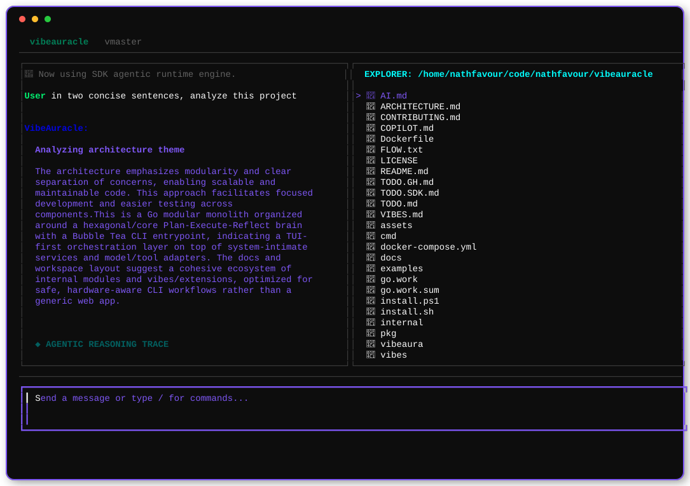

<div align="center">
  

  # vibe auracle
  **Aura vibe with the coolest CLI coding oracle**

  *VibeAuracle aims for total model-intimacy: a unified gateway for every AI in existence—from Claude Code and Copilot to its native Auracle agent.*

  > [!IMPORTANT]
  > **🔮 AURACLE MODE**: Press `Ctrl + Y` to enable an autonomous, human-like agentic loop that independently analyzes and improves your repository. It assumes its own personality to handle issues and patterns with zero user interference.

  

  [](https://github.com/nathfavour/vibeauracle/tree/release)
  [](https://github.com/nathfavour/vibeauracle/tree/master)
  [](https://go.dev)
  [](LICENSE)
</div>

---

## 🚀 Quick Install

### 🐧 Linux / 🍎 macOS / 🤖 Android
```bash
curl -fsSL https://raw.githubusercontent.com/nathfavour/vibeauracle/release/install.sh | sh
```

### 🪟 Windows
```powershell
iex (irm https://raw.githubusercontent.com/nathfavour/vibeauracle/release/install.ps1)
```

> [!TIP]
> **Trust but Verify:** You can always clone and build manually from source, or download our pre-built releases. Every release is built directly from source via GitHub Actions and includes checksums for security.

> **Pro Tip:** One install is all you need. It auto-updates by default, so you only really need `vibeaura update` if you somehow went through the trouble of disabling its autonomy.

---

## 🧠 Why? (The Motivation)
There are lots of reasons—some selfish—for me building this. I realized I spend so much time coding and wanted to optimize for three reasons:

1. **Agentic Future**: It will clearly be the future of software development.
2. **Speed**: Models will always be faster than humans. In human history, speed has always been a factor for 90% of innovation.
3. **Control**: I code so much I need to control what goes within the tools I use, instead of blindly relying on closed source tools.

Vibeaura is a lifelong project for me. Almost a decade ago, I told my brother "passive productivity" was the goal—I want to be able to work in my sleep. Coming from a mathematics and computer science background, building this is my pursuit of that ultimate efficiency.

> [!TIP]
> **Why Go?**: I simply love the ease of development and distribution. When I head to a project, the first thing I look for is how clean and easy it is to install and uninstall. That’s why I went through the trouble of implementing one of the most sophisticated distribution, install, update, and uninstall pipelines possible; you need not think; just install and start vibing.

---

## 🌌 The Vision
**vibe auracle** unifies the terminal, the IDE, and the AI assistant into a single, keyboard-centric interface. It's built for engineers who value **system-intimacy**—where the AI isn't just a chatbot, but a co-pilot with deep access to your hardware, configuration, and environment.

## 🤖 Modular Agentic Runtimes
VibeAuracle is a multi-engine orchestrator. Choose the runtime that fits your task:

- **🔮 Auracle (`/agent /auracle`)**: Our artisan internal loop (formerly Vibe Agent). Highly transparent, uses custom heuristic loop-detection, and optimized for system-intimate tasks.
- **🚀 Copilot SDK Agent (`/agent /sdk`)**: Native GitHub Copilot SDK runtime. Delegates multi-step reasoning to the official GitHub agentic engine for deep tool-intimacy and secure, high-stakes engineering.
  > *I say **native** out of gratitude: coming from a third-world country, the GitHub Education plan provided tools I could never have afforded, giving me the headstart that made me who I am today.*
- **🌌 Agentic Vibes (`/agent /custom`)**: Specialized **Vibes** that come with their own agentic capabilities. Register specialized personas with custom system prompts and restricted toolsets to create focused experts for specific workflows.

Use the `/agent` command in the TUI to toggle between engines on the fly.

## ⚡ Core Features
- **Keyboard-Centric**: Designed for speed and fluid terminal workflows.
- **Deep Integration**: Real-time awareness of system stats, files, and Git state.
- **Universal Updates**: Seamless, background updates tracking Git SHAs directly.
- **Multi-Provider**: Works with Ollama, OpenAI, and GitHub Models out of the box.
- **Cleanup First**: First-class `uninstall` support to preserve privacy and system hygiene.

---

## 🛠️ Usage
| Command | Description |
|---------|-------------|
| `vibeaura` | Launch the interactive session |
| `vibeaura update` | Pull the latest SHA from your current branch |
| `vibeaura sys stats` | View real-time system power snapshot |
| `vibeaura models` | Discover and switch AI providers |

### 🗑️ Uninstall & Clean
We respect your space. To remove the tool but keep your data:
```bash
vibeaura uninstall
```
To wipe **everything** (binary + secrets + config):
```bash
vibeaura uninstall --clean
```

---

## 🤝 Contributing
We love community "Vibes"! Check out [CONTRIBUTING.md](./CONTRIBUTING.md) to add your own agent skills.

<div align="center">
  <sub>Built with 💜 for the future of engineering.</sub>
</div>