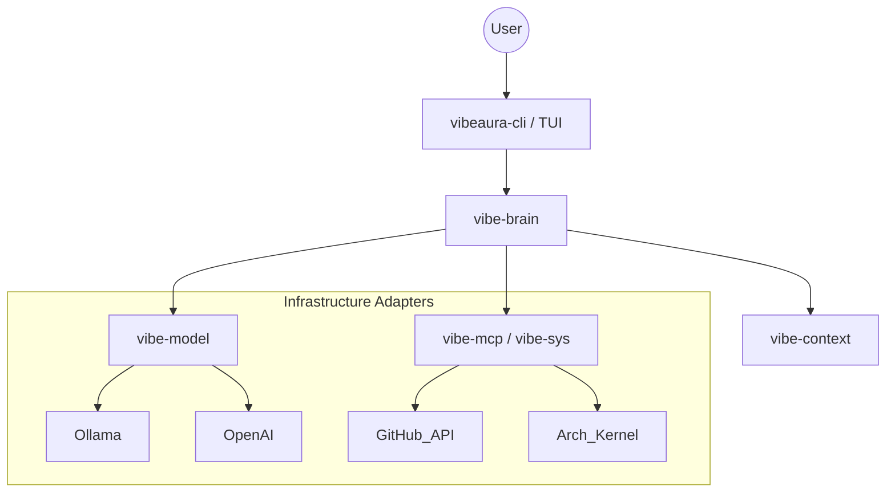

# Architecture

VibeAuracle is built as a modular ecosystem where the Brain orchestrates multiple specialized components. We utilize a **Modular Monolith** pattern orchestrated via **Go Workspaces**.

## System Architecture

The system is divided into concentric layers to prevent tight coupling, following a strict Hexagonal Architecture.



## Core Modules

The codebase is split into several core modules, coordinated by a root `go.work` file.

| Module | Responsibility |
|---|---|
| **vibeaura-cli** (`cmd/`) | Entry point. Starts the TUI session by default. Routes other commands via Cobra. |
| **vibe-brain** (`internal/brain`) | The Core. The cognitive orchestrator. Manages the "Plan-Execute-Reflect" loop and Agent state. |
| **vibe-model** (`internal/model`) | Universal AI Connector. Abstractions for streaming, tokenizing, and provider switching. |
| **vibe-context** (`internal/context`) | Memory & RAG. Handles vector embeddings, project indexing, and sliding windows. |
| **vibe-mcp** (`internal/mcp`) | Tooling Bridge. Hosts Model Context Protocol servers (GitHub, Postgres, etc.). |
| **vibe-sys** (`internal/sys`) | System Intimacy. Monitors CPU/VRAM, File Watching, and Virtual FS operations. |
| **vibe-daemon** (`internal/daemon`) | Background Service. Persists tasks, handles IPC via UDS (Unix Domain Sockets). |
| **vibe-connect** (`internal/connect`) | Remote Access. P2P tunneling and secure remote control of the CLI. |
| **vibe-vault** (`internal/vault`) | Security. Encrypted credential storage integrated with OS Keychains. |

## The Cognitive Loop ("The Brain")

The `vibe-brain` module does not just "chat." It implements a recursive agentic loop:

1. **Perceive**: The brain receives a request and takes a system snapshot (CWD, CPU, RAM, Git SHA).
2. **Contextualize**: It pulls project-specific architectural info and recent relevant chat history from `vibe-context`.
3. **Plan**: The agent selects a strategy (Ask, Plan, CRUD) and builds the augmented prompt.
4. **Execute**: The agent runs the model and optionally executes tool calls via `vibe-mcp` or `vibe-sys`.
5. **Reflect**: The agent observes tool outputs (stdout/stderr) and repeats the loop if necessary (up to 10 turns).

## Communication Layers

VibeAuracle supports multiple interaction methods:
- **TUI**: An interactive Bubble Tea-based interface for human users.
- **CLI**: Direct commands for automation and system management.
- **IPC (UDS)**: A Unix Domain Socket (`~/.vibeauracle/vibeaura.sock`) using line-delimited JSON for deep integration with external tools and IDEs.

## Extension Points

VibeAuracle is designed to be highly extensible. There are three primary ways to build on top of the ecosystem:

### 1. Vibes (Agent Skills)
"Vibes" are high-level capabilities or personalities that can be loaded into the Brain. They typically consist of:
- **System Instructions**: Specific rules or behaviors for the agent.
- **Tool Access**: A defined set of MCP or system tools the skill is authorized to use.
- **Trigger Patterns**: Conditions under which the skill should be automatically activated.

Developers can register new Vibes using the CLI:
```bash
vibeaura extension register --name "git-ops" --desc "Deep Git automation"
```

### 2. Standalone MCP Servers
The Brain can connect to any Model Context Protocol (MCP) server. These servers can be written in any language (Go, Python, TypeScript) and provide specialized tools (e.g., a database inspector, a web searcher, or a cloud orchestrator). 

External tools can tell VibeAuracle to connect to a new MCP server via the IPC socket:
```json
{
  "type": "request",
  "method": "mcp_add",
  "payload": {
    "name": "my-server",
    "command": "python3",
    "args": ["server.py"]
  }
}
```

### 3. Custom Agent Engines
If VibeAuracle's internal "Vibe" engine or the Copilot "SDK" engine doesn't fit your needs, you can register a **Custom Agent**. This allows you to define a proprietary reasoning loop while still leveraging VibeAuracle's system-intimate tools and context.

## Data & Persistence

VibeAuracle persists state in `~/.vibeauracle/`:
- `config.yaml`: Global settings and provider keys.
- `brain.db`: SQLite database for vector memory and project knowledge.
- `sessions/`: JSON-serialized conversation threads indexed by directory hash.
- `vault/`: Encrypted storage for high-stakes secrets.
